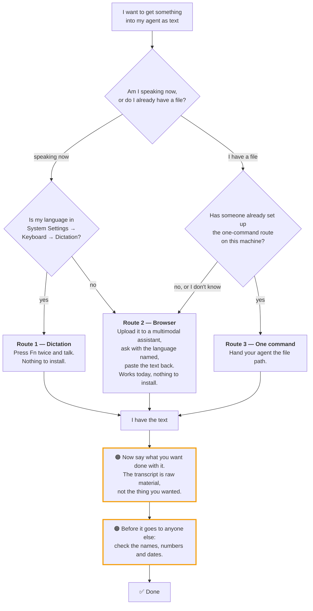

# Turning a recording into text

> This page is for **you**, not for your agent. Your agent has its own version of the
> same thing in `workspace/.claude/skills/audio-transcribe/` — three files written in
> a much drier register, because they are instructions rather than an explanation.
>
> If the two ever disagree, the agent's `SKILL.md` is right and this page is wrong.

---

## Start here: your agent cannot hear

This is the single fact that explains everything else on this page.

**Claude Code has no audio input.** It reads text, images, PDFs and notebooks. It does
not read `.m4a`, `.mp3`, `.wav`, or `.mp4`.

So what happens if you drop a recording into the chat and ask what it says?

You get an answer. It is fluent, it is confident, and it is **made up from the
filename**. If your file is called `2026-01-15-budget-review.m4a`, you will get a
plausible-sounding summary of a budget review that the agent has never heard a second of.

And it will not necessarily tell you that it failed.

> This is not hypothetical. It is why this skill was rewritten: someone recorded
> themselves, handed the file to their agent, and got back something that did not match
> what they had said. Nothing errored. There was no way for them to know.

**Audio has to become text before it reaches your agent.** Everything below is about how.

---

## Which way is yours

**If you are ever unsure, you are on Route 2.** It is the only one with nothing to
install and no precondition. It is slower, and it is never wrong to choose it.

---

## Route 1 — Dictation

The fastest one, and there is nothing to set up.

1. Put your cursor where you want the text
2. Press **`Fn` twice**
3. Talk
4. Press `Fn` again when you're done

To see whether your language is supported: **System Settings → Keyboard → Dictation**.

**If your language is not in that list, stop.** There is no workaround, no setting to
change, no plugin. The language files simply are not on the machine. Take Route 2.

---

## Route 2 — A multimodal model, in the browser

For any language dictation doesn't cover, and for any file you already have.

1. Open something that accepts audio — `gemini.google.com` works, a free account is enough
2. Upload the recording (or just speak into it)
3. Ask for it **like this** — the language line is the part that matters:

   > Transcribe this audio. The audio is in **‹your language›**. Write the transcript in
   > **‹your language›**. Do not translate unless I ask you to. If any part is unclear,
   > mark it `(unclear)` — do not guess words.

4. Copy the text back into your agent

### Why that one line matters so much

When you don't say what language it is, the model guesses. For less common languages it
guesses badly — it substitutes a **regional neighbour**, and what comes back is fluent,
confident, and wrong.

Naming the language explicitly is the single change that fixes most bad transcriptions.
**Do it even when it seems obvious.** It costs you four words.

### If you've tried a Whisper-based tool and got nonsense

Whisper, and the many products built on top of it, produce genuinely unusable output for
a number of low-resource languages. Not "a bit worse" — garbage.

That is a property of the model. You are not holding it wrong. Use a multimodal model and
name the language.

---

## Route 3 — One command

If you transcribe most weeks, the browser round-trip gets old. Route 3 turns it into a
single command your agent runs on a file path.

**It is not free of cost.** It needs:

- an API key, in **your own** account, on a free tier you can actually open
- a small script, which you and your agent write together
- about one sitting to set up, with you in the room

**Ask your agent to set it up as its own task** — not in the middle of something else.
The skill tells it to refuse if you're mid-task, and that refusal is correct behaviour.

Three questions it should ask you before starting. If it doesn't ask, something is wrong:

1. How many recordings in a normal week?
2. Whose account will hold the API key?
3. May I write a script into your workspace?

> **This repository does not ship the script.** That is deliberate — a hard-coded vendor
> endpoint is exactly the thing that goes stale and then fails quietly. You and your agent
> write it against whatever that provider's docs say today.

---

## Once you have the text

Three habits, in the order they matter.

**1. Say what you want done with it.**
"Summarise this." "Pull out the action items." "Draft a reply to the third point."
The transcript is raw material. It is almost never the thing you actually wanted.

**2. Don't edit the transcript to fix mistakes.**
Put a small table *above* it instead:

| Heard as | Should be |
|---|---|
| what the transcript says | the correct term |

Editing the text directly destroys the only record of what was actually heard. After
that you can no longer tell an accurate transcription from a confident guess, and you
can't re-check it later against a better model.

**3. Check names and numbers before it goes anywhere.**
People's names, place names, product names, prices, dates — these are exactly what speech
models get wrong, and they come back looking as confident as everything else. Verify them
against a source you trust before any of it reaches a client, a colleague, or a shared
document.

---

## When something looks wrong

| What you're seeing | What it actually is | What to do |
|---|---|---|
| A summary that sounds right but you never said any of it | The agent answered from the filename. It never heard the audio | Throw that answer away entirely. Start again at Route 1 or 2 |
| Fluent text, wrong language | The language line was missing or ignored | Name the language again and rerun. This one fixes most cases |
| Complete nonsense, and you used a Whisper-based tool | The model, not you. Whisper fails hard on some languages | Switch to a multimodal model and name the language |
| Your language isn't in the Dictation list | The language files aren't installed and can't be | Route 2. There is no workaround here |
| Names and numbers subtly wrong | Normal, and the most dangerous failure mode, because it reads as correct | The correction table above. Never trust a number you haven't checked |

---

## What to say to your agent

Copy-paste lines that work:

> I have a recording at `‹path›`. It's in ‹language›. Walk me through getting it into text.

> I'd rather talk than type this. What are my options on this machine?

> I record something most weeks. Is Route 3 worth setting up for me? Ask me whatever you
> need to know first.

> Here's a transcript. Pull out anything that was promised to someone, and who owes it.

And one worth keeping:

> Before you tell me it worked, show me the output you actually got.

---

## What this page does not cover

| Question | Where it lives |
|---|---|
| The rules your agent follows | `workspace/.claude/skills/audio-transcribe/SKILL.md` |
| Setting up Route 3, step by step | `INSTALL.md` in that same folder — written for your agent, not for you |
| Both flows as diagrams, in detail | `FLOW.md`, same folder |
| How to prove any of it worked on this machine | `VERIFY.md`, same folder |
| Installing the agent itself | Out of scope. This page assumes you already have one running |
| Translating a transcript, or cleaning it into prose | A separate request, after the transcript is safely stored |

If something on this page doesn't match what you see on your machine, **your machine is
right.** Open an issue and paste what you actually got.
