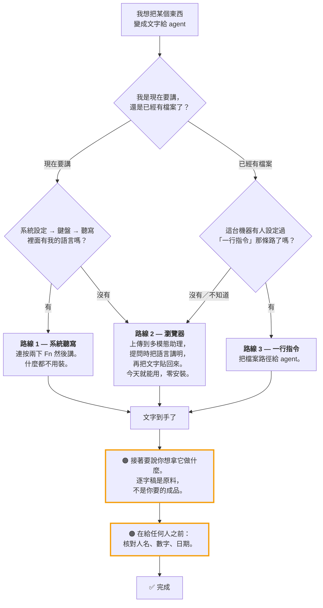

# 把錄音變成文字

> 這頁是寫給**你**看的，不是給你的 agent。你的 agent 有它自己的版本，在
> `workspace/.claude/skills/audio-transcribe/` 底下三個檔，語氣乾得多——因為那是指令，不是說明。
>
> 兩邊如果哪天講的不一樣，**以 agent 的 `SKILL.md` 為準，錯的是這一頁。**

---

## 先看這一段：你的 agent 聽不見聲音

這一件事解釋了下面所有的東西。

**Claude Code 沒有音訊輸入。** 它讀得了文字、圖片、PDF、notebook。它讀不了 `.m4a`、`.mp3`、`.wav`、`.mp4`。

那把錄音丟進對話、問它講了什麼，會發生什麼事？

你會拿到一個答案。它很流暢、很有把握，而且是**從檔名編出來的**。如果你的檔案叫
`2026-01-15-預算檢討.m4a`，你會拿到一份聽起來很像樣的預算檢討摘要——而 agent 一秒都沒聽過。

**而且它不一定會告訴你它失敗了。**

> 這不是假設。這正是這支 skill 被重寫的原因：有人自己錄了一段音、把檔案交給 agent，
> 拿回來的東西跟她講的不符。沒有跳錯誤，她也沒有任何辦法知道。

**聲音必須先變成文字，才能到 agent 手上。** 下面全部都在講怎麼變。

---

## 你該走哪一條

**不確定的時候，你就是在路線 2。** 它是唯一零安裝、零前提的一條。它比較慢，但選它永遠不算錯。

---

## 路線 1 — 系統聽寫

最快，而且完全不用設定。

1. 游標放在你要出字的地方
2. **連按兩下 `Fn`**
3. 講話
4. 講完再按一次 `Fn`

要看你的語言支不支援：**系統設定 → 鍵盤 → 聽寫**。

**如果清單裡沒有你的語言，就停在這裡。** 沒有變通辦法、沒有哪個開關可以打開、沒有外掛。
那些語言檔根本不在這台機器上。改走路線 2。

---

## 路線 2 — 瀏覽器裡的多模態模型

聽寫不支援的語言走這條，已經有檔案的也走這條。

1. 打開任何吃得下音訊的工具——`gemini.google.com` 就可以，免費帳號就夠
2. 上傳錄音（或直接對它講）
3. **照這樣問**——語言那一行才是重點：

   > Transcribe this audio. The audio is in **‹你的語言›**. Write the transcript in
   > **‹你的語言›**. Do not translate unless I ask you to. If any part is unclear,
   > mark it `(unclear)` — do not guess words.

4. 把文字貼回你的 agent

### 為什麼那一行差這麼多

你不講是什麼語言，模型就用猜的。冷門一點的語言它會猜錯——**它會換成鄰近的語言**，
然後吐回來一段流暢、有把握、而且錯的東西。

**把語言講明，是修好大部分爛逐字稿的唯一一個動作。**
就算覺得很明顯也要講。反正就多四個字。

### 如果你用過 Whisper 系的工具、拿到一堆亂碼

Whisper 以及所有架在它上面的服務，對某些低資源語言產出的東西是真的不能用。
不是「差一點」，是亂碼。

**那是模型的性質，不是你操作錯。** 換多模態模型，然後把語言講明。

---

## 路線 3 — 一行指令

如果你幾乎每週都要轉錄，瀏覽器來回會很煩。路線 3 把它變成一行指令，agent 直接吃檔案路徑。

**但它不是免費的。** 它需要：

- 一把 API key，開在**你自己的**帳號、而且是你所在地區真的申請得到的免費額度
- 一支小腳本，你跟 agent 一起寫
- 大約一次坐下來的時間，而且你要在場

**請 agent 把它當成一件獨立的事來做**——不要在別的工作做到一半的時候插進去。
skill 明文要它在你正忙別的事情時拒絕，**那個拒絕是正確行為**。

它開工前應該問你三個問題。**如果它沒問，就是有問題**：

1. 正常一週會有幾個錄音？
2. API key 要放誰的帳號？
3. 我可以在你的工作區寫一支腳本嗎？

> **這個 repo 沒有附那支腳本，是故意的。** 寫死廠商的 endpoint，正好就是那種會過期、
> 然後安靜地掛掉的東西。你跟你的 agent 照那家廠商今天的文件現寫。

---

## 拿到文字之後

三個習慣，照重要性排。

**一、說你要拿它做什麼。**
「幫我摘要」「把待辦抓出來」「針對第三點草擬一個回覆」。
逐字稿是原料，幾乎從來不是你真正想要的那個東西。

**二、不要為了修錯字去改逐字稿。**
在它**上面**放一張小表格就好：

| 聽成 | 應該是 |
|---|---|
| 逐字稿寫的 | 正確的寫法 |

直接改正文，會毀掉「當初實際聽到什麼」的唯一紀錄。改完之後你再也分不出哪句是準確的轉錄、
哪句是有把握的猜測，日後也沒辦法換更好的模型重跑對照。

**三、出去之前先核對人名和數字。**
人名、地名、產品名、價格、日期——這些正是語音模型最會錯的，而且錯得跟對的一樣有信心。
在任何東西送到客戶、同事、或共用文件之前，拿一個你信得過的來源核過。

---

## 看到這個代表什麼

| 你看到的 | 實際是什麼 | 怎麼辦 |
|---|---|---|
| 一份聽起來很對、但你根本沒講過那些話的摘要 | agent 從檔名編的，它沒聽過音檔 | 那個答案整份丟掉。回頭從路線 1 或 2 重來 |
| 文字很流暢，但語言錯了 | 語言那一行漏了、或被忽略 | 把語言再講一次重跑。這一招修掉大部分情況 |
| 完全是亂碼，而且你用的是 Whisper 系工具 | 模型的問題，不是你的。Whisper 對某些語言就是壞的 | 換多模態模型，並且把語言講明 |
| 聽寫清單裡沒有你的語言 | 語言檔沒裝，也裝不了 | 走路線 2。這裡沒有變通辦法 |
| 人名、數字有些微妙的錯 | 正常，而且是**最危險**的一種——因為它讀起來是對的 | 用上面那張對照表。沒核過的數字一律不要信 |

---

## 可以直接貼給 agent 的句子

> 我有一個錄音在 `‹路徑›`，內容是‹語言›。帶我走一遍怎麼把它變成文字。

> 這段我想用講的，不想打字。這台機器上我有哪些選擇？

> 我幾乎每週都要錄一些東西。路線 3 對我值得設定嗎？你需要知道什麼先問我。

> 這是一份逐字稿。把裡面「答應了誰要做什麼」的部分抓出來，標出是誰欠誰。

還有一句值得留著：

> 在你跟我說「好了」之前，先把你實際跑出來的輸出貼給我看。

---

## 這頁不管的事

| 問題 | 在哪 |
|---|---|
| 你的 agent 實際遵守的規則 | `workspace/.claude/skills/audio-transcribe/SKILL.md` |
| 路線 3 一步一步怎麼設定 | 同資料夾的 `INSTALL.md`——寫給你的 agent 看，不是給你看的 |
| 兩條流程的完整圖 | 同資料夾的 `FLOW.md` |
| 怎麼證明這些在你這台機器上真的動了 | 同資料夾的 `VERIFY.md` |
| agent 本身怎麼安裝 | 不在範圍內。這頁假設你已經有一個在跑了 |
| 把逐字稿翻譯、或整理成通順的文章 | 那是另一個要求，等逐字稿安全存好之後再說 |

如果這頁講的跟你機器上看到的不一樣，**你的機器是對的。**
去開一個 issue，把你實際拿到的東西貼上去。
