# audio-transcribe: the two flows

> ⚠️ **This file is a view, not the authority.** The rules live in `SKILL.md` in this same
> folder. If this file and `SKILL.md` disagree, `SKILL.md` wins and **this file is the one
> that is wrong** — say so out loud instead of following it, and open an issue.

Two diagrams, because they answer two different questions:

- **Figure 1 — how you set it up.** One-time, ask-first, and only for Route 3. Routes 1 and 2
  have no setup at all; if you are here to transcribe something *today*, you want Figure 2.
- **Figure 2 — how a run actually goes.** From "I have a recording" to text the agent can work
  with, including every way it goes wrong on the way.

> If your viewer does not render Mermaid, skip to the route table below — it carries the same
> routing in prose.

**Colour legend (both figures):**

- 🟠 **orange** — a person has to answer this before you move. Do not answer it for them.
- 🔴 **red** — a hard limit, or a wrong turn. Do not push through it and do not plain-retry it;
  take the arrow out. Where an arrow loops back, it loops back with something changed.

---

## Figure 1 — Setting up Route 3 (one time, ask first)

Route 3 is the only part of this skill that has an installation. `SKILL.md` gates it in one
sentence: *"Ask before you start — it is a setup task, not something to attempt in the middle
of other work."* Both halves of that sentence are gates below.

```mermaid
flowchart TD
  T1["The user says: I record something most weeks,<br/>can this just be one command?"]
  T1 --> G_MID{"Are you in the middle of another task<br/>right now? SKILL.md: 'it is a setup task,<br/>not something to attempt in the<br/>middle of other work'"}
  G_MID -->|"yes"| S_LATER["🔴 Stop. Say so, and finish that first.<br/>Route 2 needs no setup and works today."]
  S_LATER -.->|"come back once<br/>that task is closed"| G_MID

  G_MID -->|"no"| G_ASK["🟠 Ask, and wait for an actual answer:<br/>1. How many recordings in a normal week?<br/>2. Whose account will hold the API key?<br/>3. May I write a script into your workspace?"]
  G_ASK -->|"only occasionally — SKILL.md:<br/>'a browser round-trip is<br/>fine occasionally'"| S_R2A["🔴 Say so and stop: Route 3 costs more to build<br/>and keep than it saves here. Route 2 has nothing<br/>to install, nothing to maintain, nothing to leak.<br/>They answered the question — they can overrule you."]
  G_ASK -->|"go ahead"| LOOK["From the folder that holds CLAUDE.md, run:<br/>ls .claude/skills/audio-transcribe/<br/>Read every .md it lists — the folder may hold more<br/>than this file mentions, and the folder is the newer<br/>word. What it does NOT hold: any transcription<br/>script, and there is no workspace/tools/ directory."]

  LOOK --> FRAME["So 'setting up' means: you and the user build<br/>one small command in their own space.<br/>There is nothing to download from us."]
  FRAME --> G_PROV["🟠 Recommend one provider, say in one line why,<br/>then stop and wait. The account is opened by them<br/>and the key is created by them — and your pick<br/>is theirs to overrule."]

  G_PROV --> Q_FREE{"Can they actually open that free tier<br/>— their country, no card required?"}
  Q_FREE -->|"no"| S_R2B["🔴 That provider is closed to them.<br/>Either they name another,<br/>or you stop: Route 2 needs no account."]
  S_R2B -.->|"user names<br/>another provider"| G_PROV

  Q_FREE -->|"yes"| KEY["Key goes in a file OUTSIDE this repo, chmod 600.<br/>Never paste it into the chat.<br/>Never put it under workspace/ — this clone's<br/>origin is a public repository."]
  KEY --> KEYV{"git status --short<br/>Does anything holding the key show up?"}
  KEYV -->|"yes, it landed<br/>inside the repo"| S_MOVE["🔴 Move it out before writing another line.<br/>The repo's .gitignore catches some secret filenames<br/>and misses others — open it and read it,<br/>do not assume. It is a backstop for accidents,<br/>not the plan."]
  S_MOVE -.-> KEY

  KEYV -->|"clean"| SCRIPT["Write one script: takes a file path,<br/>prints the transcript. One entry point, one job.<br/>Name the language inside it — Figure 2 shows why."]
  SCRIPT --> TEST["Run it on a real 30-second recording,<br/>in the language they actually use,<br/>with the user in the room to hear the difference."]
  TEST --> Q_OK{"Does the text match<br/>what they just said?"}
  Q_OK -->|"garbage, or a<br/>neighbouring language"| S_LANG["🔴 That is the model, not your setup.<br/>SKILL.md: Whisper-based tools return garbage<br/>for a number of low-resource languages.<br/>This provider is closed — go back to Route 2."]

  Q_OK -->|"it matches"| WRITE["Write the exact command and where the key lives<br/>into the user's own notes.<br/>Tomorrow's session remembers none of today."]
  WRITE --> DONE["✅ Route 3 is live.<br/>Every run from now on is Figure 2."]

  classDef gate stroke:#f59e0b,stroke-width:3px;
  classDef stop stroke:#dc2626,stroke-width:3px;
  class G_ASK,G_PROV gate;
  class S_LATER,S_R2A,S_R2B,S_MOVE,S_LANG stop;
```

**The two nodes people skip.** `G_ASK` — because setup feels helpful, so it gets done silently
in the middle of something else. And `TEST` — because a script that exits 0 looks finished. It
isn't: a transcript can come back fluent, confident and completely wrong, and the only way to
find that out is to have someone in the room who knows what was said.

---

## Figure 2 — A run, start to finish

```mermaid
flowchart TD
  A1["You have a file:<br/>something.m4a / .mp3 / .wav / .mp4"]
  A2["You would rather say it than type it"]
  A1 --> WALL
  A2 --> WALL

  A1 -.->|"the tempting<br/>wrong move"| DROP["Drop the file into the chat<br/>and ask what it says"]
  DROP --> GUESS["🔴 The agent answers from the filename.<br/>It looks like an answer and is not one —<br/>and it will not necessarily tell you it failed."]
  GUESS -.->|"throw that answer away,<br/>start again here"| WALL

  WALL["🔴 The hard wall: the agent cannot hear.<br/>Read handles images, PDFs and notebooks.<br/>It does not handle .m4a / .mp3 / .wav / .mp4.<br/>Audio has to become text before it reaches the agent."]

  WALL --> Q_KIND{"Is this a live thought,<br/>or a file that already exists?"}
  Q_KIND -->|"a live thought"| R1_CHK
  Q_KIND -->|"a file"| Q_R3

  R1_CHK{"ROUTE 1. macOS: System Settings →<br/>Keyboard → Dictation.<br/>Is your language in that list?"}
  R1_CHK -->|"yes"| R1_GO["Press Fn twice, then speak.<br/>The text lands in whatever box<br/>you were typing in."]
  R1_CHK -->|"no"| R1_NO["🔴 Stop. There is no workaround.<br/>The language assets are not on the machine<br/>and retrying will not change that."]
  R1_CHK -->|"not on macOS — SKILL.md<br/>documents only that path"| R2_OPEN
  R1_NO --> R2_OPEN
  R1_GO --> TEXT

  Q_R3{"ROUTE 3. Is it set up on this machine?<br/>Does the command exist, is the key there?"}
  Q_R3 -->|"no — Route 2 today.<br/>Setting it up now would trip Figure 1's gate"| R2_OPEN
  Q_R3 -->|"yes"| R3_RUN["Run the one command from Figure 1<br/>against the file path."]
  R3_RUN --> TEXT

  R2_OPEN["ROUTE 2. Open a multimodal assistant that<br/>accepts audio — gemini.google.com, a free<br/>account is enough. Speak into it, or upload the file."]
  R2_OPEN --> R2_ASK["Ask it with the language line — that line<br/>is the part that matters:<br/>'Transcribe this audio. The audio is in LANG.<br/>Write the transcript in LANG. Do not translate<br/>unless I ask. Mark anything unclear as unclear —<br/>do not guess words.'"]
  R2_ASK --> Q_SANE{"Read the first few lines.<br/>Right language? Does it sound<br/>like what was actually said?"}

  Q_SANE -->|"fluent and confident,<br/>but a neighbouring language"| R2_LANG["🔴 The language line was missing or ignored.<br/>Name the language again and rerun — that one line<br/>fixes most bad transcriptions. Do it even<br/>when the language seems obvious."]
  R2_LANG -.-> R2_ASK
  Q_SANE -->|"nonsense — and the tool<br/>was Whisper-based"| R2_WHIS["🔴 A property of the model, not your mistake.<br/>Whisper and the services built on it return garbage<br/>for a number of low-resource languages.<br/>Use a multimodal model and name the language."]
  R2_WHIS -.-> R2_OPEN
  Q_SANE -->|"reads right"| R2_BACK["Copy the text back into the agent."]
  R2_BACK --> TEXT

  TEXT["The transcript now exists as text,<br/>inside the agent."]
  TEXT --> SAY["🟠 Say what you want done with it:<br/>summarise this, pull out the action items,<br/>draft a reply. The transcript is raw material,<br/>not the deliverable."]
  SAY --> Q_WRONG{"Something in it is wrong —<br/>a name, a number, a garbled line"}

  Q_WRONG -->|"just fix it in<br/>the transcript"| EDIT_NO["🔴 No. That destroys the only record of what was<br/>actually heard. Afterwards you cannot tell an accurate<br/>transcription from a confident guess, and you cannot<br/>re-check it later against a better model."]
  EDIT_NO -.->|"do this instead"| FIXTAB
  Q_WRONG -->|"leave the text alone"| FIXTAB["Put a two-column table ABOVE the transcript —<br/>'Heard as' and 'Should be'.<br/>The transcript itself stays untouched."]
  Q_WRONG -->|"nothing looks wrong"| GATE_OUT
  FIXTAB --> GATE_OUT

  GATE_OUT["🟠 Before any of it reaches a client, a colleague<br/>or a shared document: check names, places, product<br/>names, prices and dates against a source you trust.<br/>Those are exactly what speech models get wrong,<br/>and they come out as confident as everything else."]
  GATE_OUT --> OUT["✅ The agent works on the text —<br/>and the original is still there to re-check."]

  classDef gate stroke:#f59e0b,stroke-width:3px;
  classDef stop stroke:#dc2626,stroke-width:3px;
  class SAY,GATE_OUT gate;
  class WALL,GUESS,R1_NO,R2_LANG,R2_WHIS,EDIT_NO stop;
```

**Read the two red loops as the whole point of the diagram.** `DROP → GUESS` and
`Q_SANE → R2_LANG` are the same failure wearing two costumes: something comes back that reads
like a correct answer and is not one. Neither raises an error. Both are only caught by a human
who knows what was said.

---

## The three routes, side by side

| | **Route 1 — system dictation** | **Route 2 — multimodal model, in the browser** | **Route 3 — one command, scripted** |
|---|---|---|---|
| **What it assumes** | macOS, and your language listed under System Settings → Keyboard → Dictation | A browser and a free account somewhere | Figure 1 already done: a free API key in the user's own account, and a script they agreed to |
| **What you feed it** | Your voice, live, into the box you are typing in | Your voice, or a recording you upload | A file path |
| **What comes back** | Text, already in the box | Text you copy back into the agent yourself | Text, where the agent can read it |
| **How long** | As long as it takes to say it | A few minutes per recording — every recording, every time | One sitting to set up; one command after that |
| **Where it breaks** | Your language is not on the list | You left the language line out, so it guessed — and guessed a regional neighbour | The provider returns garbage for your language; that is the model, not the setup |
| **When not to use it** | The moment the language is missing. There is no workaround — stop and take Route 2 | Never actually wrong, only slow. Volume is the one honest reason to leave it | Only occasionally — `SKILL.md`: "a browser round-trip is fine occasionally". Below that it costs more to build and keep than it saves. And never mid-task |

**Route 2 is the floor.** Every red node that closes off a *route* points back at it, because it is
the only route with no machine-specific precondition. (`S_MOVE` and `EDIT_NO` are not route choices
— they point at the fix beside them.) If you are ever unsure which route you are on, you are on
Route 2 and you have not named the language yet.

---

## What this file does not cover

| Question | Where it belongs |
|---|---|
| The rules themselves, and anything this file contradicts | `SKILL.md`, same folder — the authority |
| Which provider to use for Route 3 | Not in this file. `SKILL.md` names none on purpose — whoever recommends one, the account is opened and the key is held by the user |
| Installing the agent itself | Out of scope. Both figures assume an agent is already running on the machine |
| Translating the transcript, or cleaning it up into prose | Not this skill. Ask for it as a separate step, after the transcript is safely stored |
| What to do with the text afterwards | Whatever the user asked for. The last three nodes of Figure 2 are the only rules this skill imposes |

If a diagram here stops matching what you actually see on a machine, the machine is right.
Open an issue with the real output of the command you ran, and say what it contradicted.
