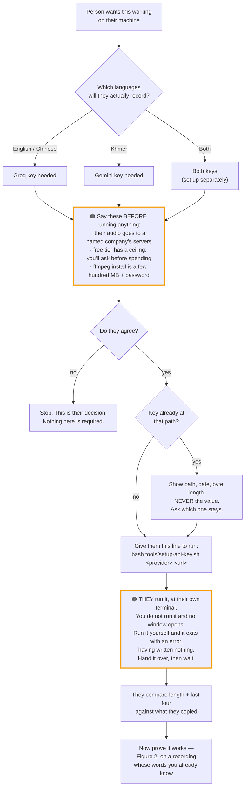
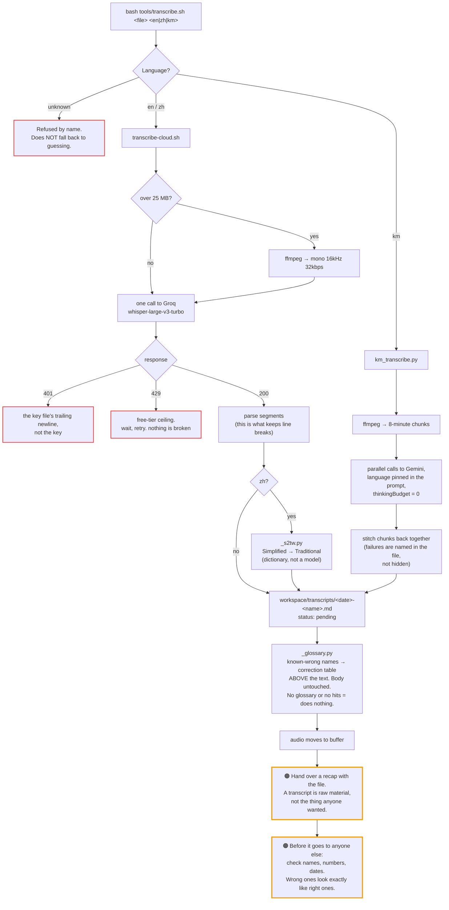

# audio-transcribe: the two flows

Two diagrams. **Figure 1** is setup, which happens once on a machine. **Figure 2** is a run, which happens every time afterwards.

Neither is a substitute for `INSTALL.md` — the diagrams show the shape, that file says why the shape is that way and what it looks like when a step fails.

---

## Figure 1 — Setting up (one time, ask first)

Setup is a task of its own. Do not start it in the middle of something else, and do not start it without saying what it costs first: an account with a provider, a free tier with a ceiling, and their audio being sent to a named company's servers.

**The one thing that is not negotiable in this figure:** you never receive the key value. Not pasted to you, not read back for confirmation, not "just the last part to check". `INSTALL.md` §2 says why.

---

## Figure 2 — A run, start to finish

**`status: pending` is doing work.** It means *transcribed, not yet filed anywhere*. A transcript left at `pending` is unfinished business, not a finished job — that field is how you find the ones that got dropped.

---

## What this file does not cover

- **Why Khmer takes a different provider**, and why you should not re-test that → `INSTALL.md` §2.
- **What each silent failure looks like from the outside** → `INSTALL.md` §3, and `QA.md` in the person's own words.
- **How to prove any of this works on this machine** → `VERIFY.md`. A diagram is a claim about the code, not evidence about the machine.
